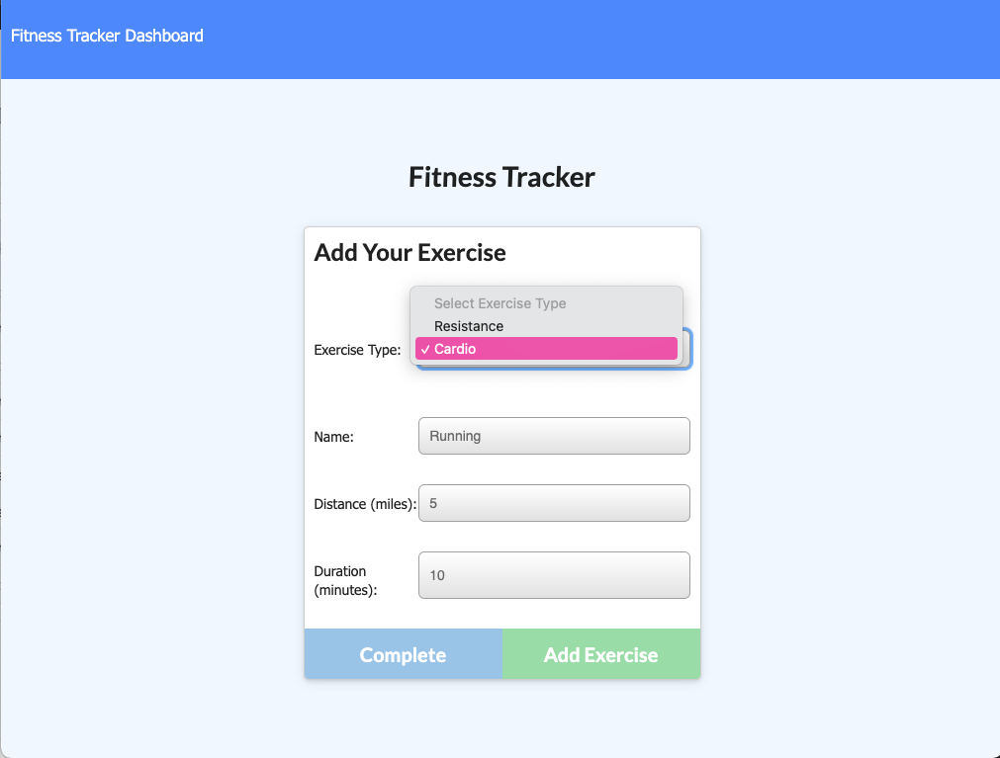
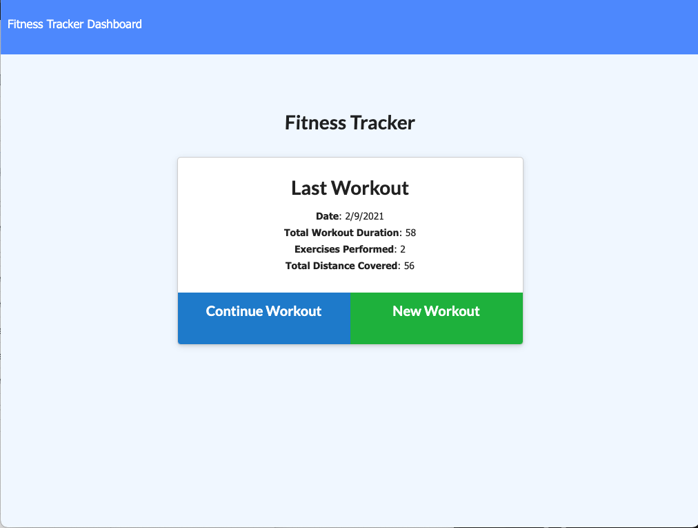

# fitnessTracker
This is a Fitness Tracker app created using MongoDB and Mongoose. This app is designed to track your fitness journey, it populates the last 7 days of workouts that you log. The point of this app is for the user to achieve their workout progress.

When you enter the homepage the first thing that you see is the fitness tracker with your last workout logged on it. From there you can either choose to continue the current workour or start a new workout. 

 GitHub Repo Link: https://github.com/Claudialhc/fitnessTracker

 Heroku Deployed Link: https://secure-ridge-03555.herokuapp.com/
